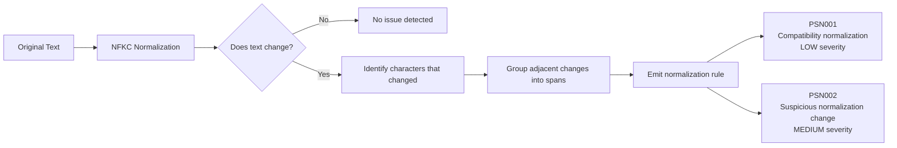

# Unicode Normalization Detector

The normalization detector identifies text that **changes when converted to Unicode NFKC (Normalization Form Compatibility Composition)**.

Normalization can transform compatibility characters, presentation forms, or mathematical glyphs into canonical equivalents.

When the normalized text differs from the original text, it can create situations where:

> **What a human sees is not exactly what the system interprets.**

PromptShield surfaces these differences so they can be reviewed.

---

## Why this matters

Unicode allows many visually similar or stylistic characters to represent the same logical text.

Examples include:

- compatibility glyphs
- full-width characters
- mathematical alphabets
- ligatures
- presentation forms

When these characters normalize to different text, it may affect:

- prompt interpretation
- system instructions
- authentication text
- code
- policy enforcement logic

Normalization differences are not inherently malicious, but they can introduce **ambiguity and bypass opportunities**.

---

## Detection rules

The detector emits two rules depending on the type of normalization change.

---

### PSN001 

> Compatibility normalization: Compatibility character normalizes to simple ASCII text.

Severity: **LOW**

These are typically benign stylistic or compatibility characters.

Examples:

```

① → 1
㎏ → kg
ff → ff

```

These characters are common in multilingual or typographic text but can still introduce subtle ambiguity.

---

## PSN002

> Suspicious normalization change: Normalization produces non-trivial or multi-character transformations.

Severity: **MEDIUM**

These changes may be more likely to affect interpretation or introduce unexpected behavior.

Examples:

```

ℌ → H
Ⅸ → IX
㍿ → 株式会社

```

Such transformations may alter token boundaries or expand into multiple characters.

---

## Example

### Input

```

ℌello admin

```

### Normalized

```

Hello admin

```

### Result

The character `ℌ` (black-letter capital H) normalizes to `H`.

PromptShield reports the span as **normalization-sensitive**.

---

## Detection model

The detector performs a deterministic lexical scan:

1. Normalize the text using **NFKC**
2. Compare each character to its normalized representation
3. Identify characters that change under normalization
4. Group adjacent differences into spans
5. Emit one threat per span

Span semantics:

```

offendingText = original span
decodedPayload = normalized span

```

Normalization may expand characters (example: `ff → ff`), so the decoded payload is derived from the normalized span.



---

## What this detector does NOT do

The normalization detector intentionally does **not**:

- block multilingual content
- enforce normalization automatically
- perform semantic interpretation
- classify text as malicious

It only reports **normalization differences that may affect interpretation**.

---

## When this matters most

Normalization differences are most relevant in:

- system prompts
- tool instructions
- code generation inputs
- security-sensitive text
- identity strings
- configuration files

They are generally less important in:

- natural multilingual prose
- UI copy
- documentation text

---

## Remediation

Recommended fixes:

- Replace compatibility characters with their normalized equivalents
- Avoid stylistic Unicode variants in prompts or code
- Normalize text before performing security-sensitive comparisons

---

## References

Unicode Standard Annex #15 — Unicode Normalization Forms  
https://unicode.org/reports/tr15/

PromptShield rule reference  
https://promptshield.js.org/docs/detectors/normalization
```
